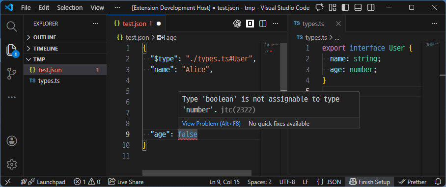

# JTC (JSON/YAML Type Checker)

JTC validates `json`, `jsonc`, and `yaml` documents against TypeScript types using a `$type` field.

## How It Works

1. Write `$type` in your document (example: `"./types.ts#MyType"`).
2. JTC parses the document into an internal rough JSON structure.
3. JTC runs TypeScript diagnostics for that value against the target type.
4. Diagnostics are shown directly in VS Code.

`$type` itself is treated as metadata and excluded from type checking.

## Example



```json
{
  "$type": "./types.ts#User",
  "name": "Alice",
  "age": 20
}
```

`./types.ts`

```ts
export interface User {
  name: string;
  age: number;
}
```

If a value has the wrong type, JTC reports a diagnostic at the corresponding JSON/YAML path.
